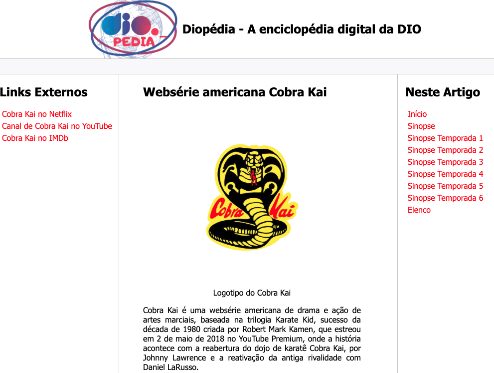
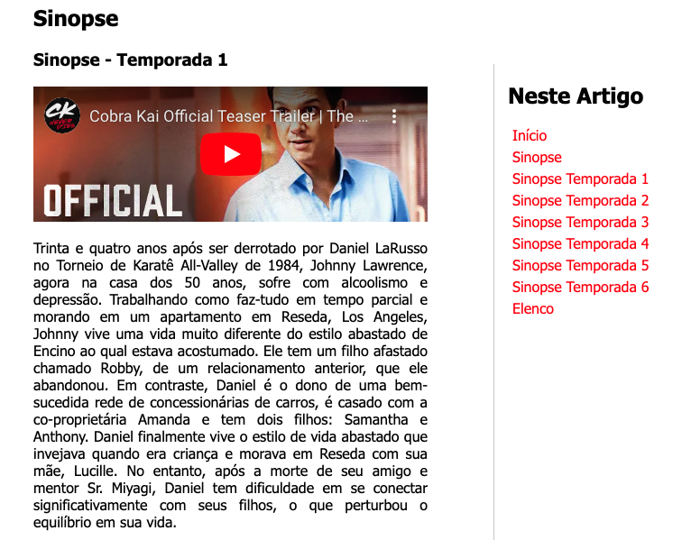
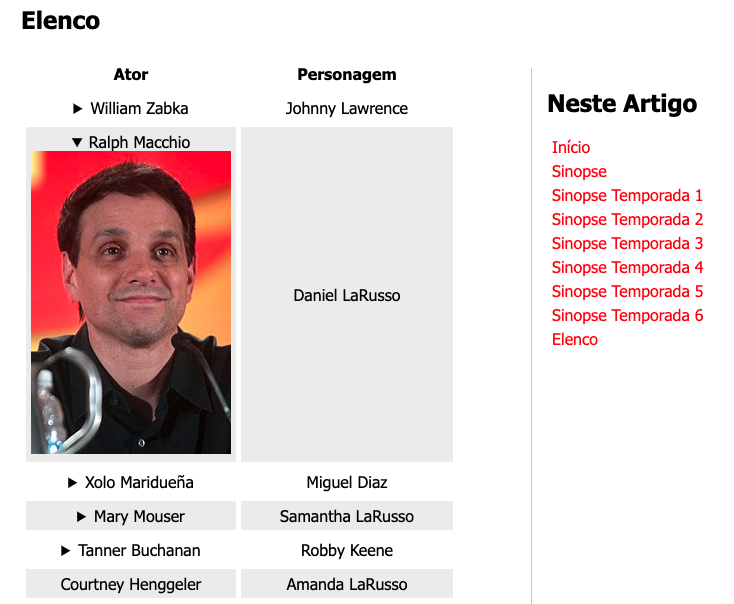

# Módulo 3 - Trilha HTML

**Título:** Recriando Wikipedia, com um layout melhor :)

## Objetivo
Este desafio consiste em treinar você com relação a estrutura do site, e também aplicar conhecimentos adiquiridos sobre semântica e acessibilidade.

## Desafio
Neste repositório tem uma estrutura básica já pré-montada de um layout simples com um pouco de CSS aplicado. Apenas para deixar mais apresentável.

Fiquem a vontade para criar da forma que desejarem, e sobre os temas que quiserem. O intuito aqui é divertir, e ao mesmo tempo aprender com o desafio.

Sigam as intruções da chamada do vídeo. Acredito que por lá, ficará mais fácil de entenderem como proceder.

## Links úteis
- [Download do NVDA](https://www.nvaccess.org/download/)
- [Wikipedia](https://pt.wikipedia.org/)

## Desafio respondido por Alisson Rangel
- Tema do desafio foi a Série Cobra Kai;
- usei as tags img, iframe, details, summary, figure, figcaption, main, header, footer, article, section, aside;
- usei as tags details e summary para mostrar e esconder a foto dos atores do elenco da série;
- usei a tag iframe para mostrar vídeos do youtube com o trailer de cada temporada; 
- criei uma logotipo.

## Imagens do site

